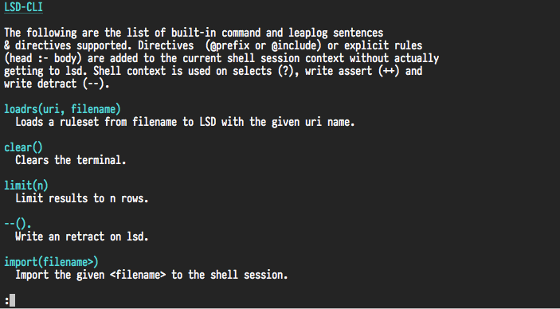

# LSD CLI

Leapsight Semantic Dataspace Command Line Tool

## Install

    $ pip install lsd-cli

## Usage

To use it simply run:

    $ lsd-cli --help

## Development

If you want to test this tool and contribute to the development clone this repository
and start submitting your changes.

If you don't use `pipsi`, you're missing out.
Here are [installation instructions](https://github.com/mitsuhiko/pipsi#readme).

Simply run the following to install it locally:

    $ pipsi install --editable .

Then:

    $ export PATH=$PATH:~/.local/bin

## Taste some awesome lsd-cli!

Welcome screen:

Help screen:

A beautifully formated query result:

